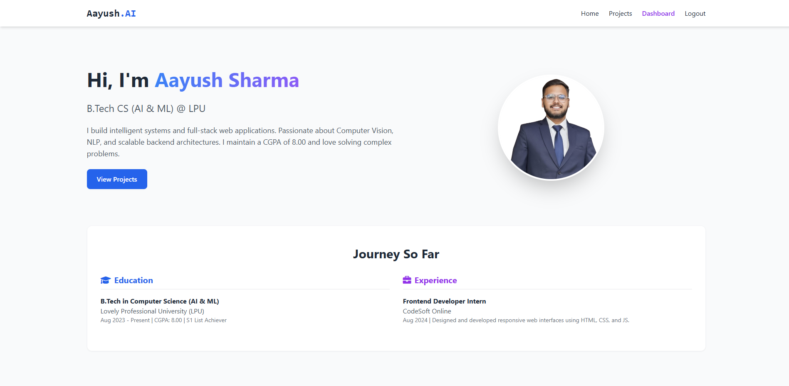
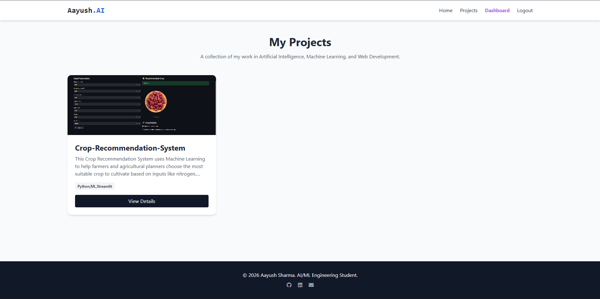
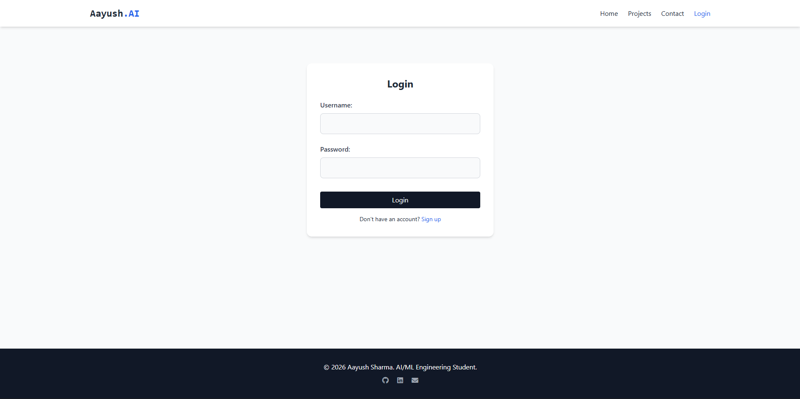
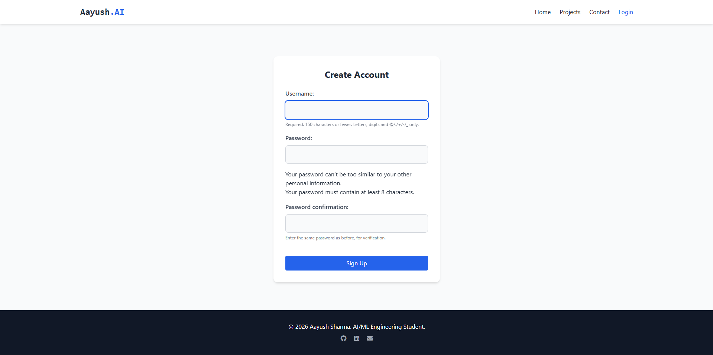
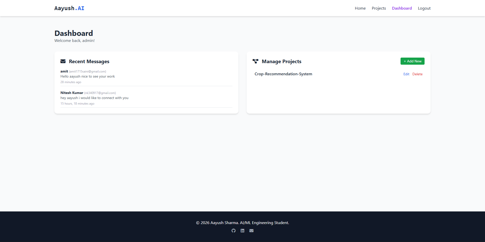
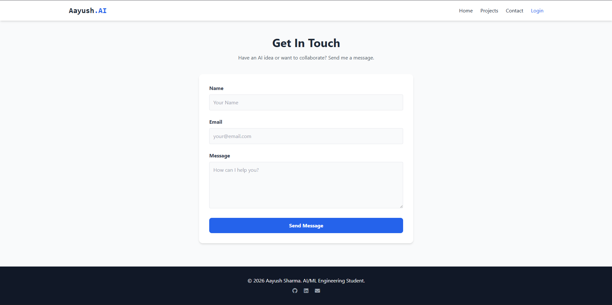

# 🚀 Aayush Sharma | AI & ML Portfolio Website

Welcome to the source code of my professional portfolio!  
This is a robust, full-stack web application built using **Django (Python)**, **PostgreSQL**, and **Tailwind CSS**.

It showcases my projects in **Artificial Intelligence**, **Machine Learning**, and **Software Development**.

# Live Website Link(Render):
[Aayush-Sharma-Portfolio](https://aayush-portfolio-51tn.onrender.com/)

## **Website Screenshots** at the end  ⬇️

---

## ✨ Features

- 🔹 **Dynamic Portfolio**  
  A clean, responsive UI highlighting my skills (Python, Scikit-learn, CV, NLP) and projects (Crop Recommendation, Health Diagnosis, OMR Checker).

- 🔹 **Project Details with Slugs**  
  SEO-friendly URLs for individual project case studies  
  *(e.g., `/projects/omr-checker/`)*

- 🔹 **Secure Authentication**  
  Full login, signup, and session management system.

- 🔹 **Admin Dashboard**  
  A protected portal where the admin can dynamically add, edit, or delete projects without touching the code.

- 🔹 **Integrated Contact System**  
  A working contact form that:
  - Saves messages securely to PostgreSQL
  - Uses Gmail SMTP to send instant email notifications

- 🔹 **REST APIs**  
  Exposes endpoints using Django REST Framework (DRF) to fetch project data.

---

## 🛠️ Tech Stack

### Backend
- Python 3.11  
- Django 5.x  
- Django REST Framework  

### Database
- PostgreSQL (using psycopg2)

### Frontend
- HTML5  
- Tailwind CSS (CDN) 
- JavaScript  

### Other Tools
- SMTP Email Integration  
- python-dotenv  

---

# 🚀 Local Setup Instructions

Follow these steps to run the project on your local machine.

---

## 1️⃣ Prerequisites

- Python 3.11+ installed
- PostgreSQL installed and running locally

---

## 2️⃣ Clone the Repository

```bash
git clone https://github.com/Aayush-infinity2/portfolio-site.git
cd portfolio-site
```

---

## 3️⃣ Set Up Virtual Environment

```bash
python -m venv .venv

# On Windows:
.venv\Scripts\activate

# On Mac/Linux:
source .venv/bin/activate
```

---

## 4️⃣ Install Dependencies

```bash
pip install -r requirements.txt
```

---

## 5️⃣ Configure Environment Variables

Create a file named `.env` in the root directory (next to `manage.py`) and add:

```env
SECRET_KEY=your-secret-key
DEBUG=True
ALLOWED_HOSTS=*

DB_NAME=Admin
DB_USER=postgres
DB_PASSWORD=your_db_password
DB_HOST=localhost
DB_PORT=5432

EMAIL_HOST_USER=your_email@gmail.com
EMAIL_HOST_PASSWORD=your_app_password
```

⚠️ **Important:** Do NOT commit this file to version control.

---

## 6️⃣ Database Migrations

Create the necessary tables:

```bash
python manage.py makemigrations
python manage.py migrate
```

---

## 7️⃣ Create an Admin Account

```bash
python manage.py createsuperuser
```

---

## 8️⃣ Run the Development Server

```bash
python manage.py runserver
```

The site will now be accessible at:

```
http://127.0.0.1:8000/
```

---

# 📂 Project Structure

```
core/       → Main Django settings and URL routing  
projects/   → Portfolio project logic, models, views  
contact/    → Message handling and SMTP email routing  
accounts/   → Authentication and admin dashboard  
api/        → DRF serializers and viewsets  
```

---
# 🖥️ Website Screenshots


## 🏠 Home Page


## 📂 Projects Page


## 🔐 Login Page


## 📝 Signup Page


## 📊 Dashboard Page


## 📬 Contact Page


---

# 📫 Let's Connect

- 🔗 **LinkedIn:** Aayush Sharma  
- 💻 **GitHub:** Aayush-infinity2  
- 📧 **Email:** aayushsharma1715@gmail.com  

---

⭐ If you like this project, consider giving it a star!


